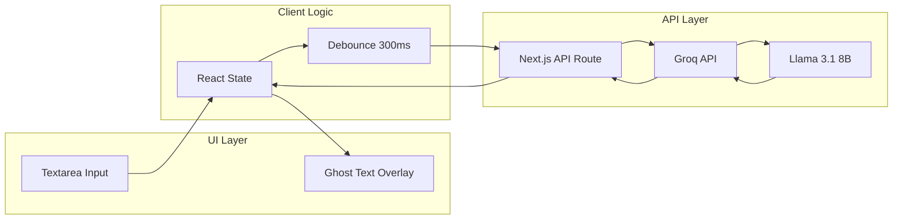

# Text Autocomplete System

## Architecture Overview



## 1. UI Implementation: Ghost Text Overlay

The standard approach for inline suggestions (used by Copilot, VS Code, etc.) is a **dual-layer technique**:

- **Layer 1**: Regular textarea where user types
- **Layer 2**: Absolutely positioned div that overlays the textarea, showing the current text + ghost suggestion in a faded color
```
┌────────────────────────────────────┐
│ The quick brown [fox jumps over]   │  <- Ghost text in gray
│                  ↑                 │
│            User's cursor           │
└────────────────────────────────────┘
```


**Key implementation details:**

- Both layers must have identical fonts, padding, line-height
- Ghost layer uses `pointer-events: none` so clicks pass through
- Suggestion text rendered with `opacity: 0.4` or gray color
- Tab key press accepts the suggestion

**File to modify:** [`app/page.tsx`](app/page.tsx) - Replace simple textarea with autocomplete component

## 2. API Route for Suggestions

Create a Next.js API route that calls Groq:

**New file:** `app/api/suggest/route.ts`

```typescript
// POST /api/suggest
// Body: { text: string, cursorPosition: number }
// Returns: { suggestion: string }
```

## 3. Groq Integration with Llama 3.1 8B

**Why Groq + Llama 3.1 8B is a good choice:**

- Groq's inference speed: ~500+ tokens/sec (fastest available)
- Llama 3.1 8B: Good balance of quality and speed
- Typical response time: 100-300ms for short completions

**Install:** `groq-sdk` package

**Prompt strategy for text completion:**

```
Continue this text naturally (1-2 sentences max):
"{user_text}"
```

## 4. Client-Side Optimization

For Copilot-like responsiveness:

| Technique | Purpose |

|-----------|---------|

| **Debouncing** | Wait 300ms after typing stops before requesting |

| **Request cancellation** | Cancel pending requests when user types more |

| **Optimistic caching** | Cache recent suggestions |

| **Minimum text length** | Only suggest after 10+ characters |

## 5. Key Interaction Flow

1. User types text
2. After 300ms pause, send text to `/api/suggest`
3. API calls Groq with completion prompt
4. Response displayed as ghost text overlay
5. **Tab key**: Accept suggestion (append to text)
6. **Any other key**: Dismiss suggestion, continue typing

## Files to Create/Modify

| File | Action | Purpose |

|------|--------|---------|

| [`app/page.tsx`](app/page.tsx) | Modify | Add autocomplete component |

| `app/components/AutocompleteTextarea.tsx` | Create | Main component with ghost text |

| `app/api/suggest/route.ts` | Create | Groq API integration |

| `app/hooks/useAutocomplete.ts` | Create | Debouncing, state management |

| `.env.local` | Create | Store `GROQ_API_KEY` |

| `package.json` | Modify | Add `groq-sdk` dependency |

## Alternative Approaches Considered

**Option A (Recommended): Dual-layer textarea**

- Pros: Simple, works with native textarea behavior
- Cons: Need to sync styles carefully

**Option B: Contenteditable div**

- Pros: More control over rendering
- Cons: Complex cursor management, accessibility issues

**Option C: Monaco/CodeMirror editor**

- Pros: Built-in suggestion support
- Cons: Overkill for plain text, large bundle size

## Chrome Extension (Phase 2)

Once the core is working, the same logic can be extracted into a Chrome extension that injects into any text input on the web. This would involve:

- Content script to detect text inputs
- Background service worker for API calls
- Same ghost text overlay technique

Recommend completing the web app first to validate the UX and API integration.