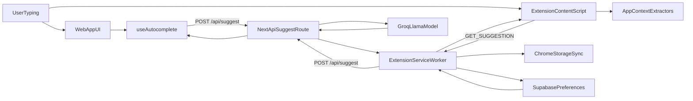

# TabTab Architecture

This document explains how TabTab is structured and how data flows through the system.

## Overview

TabTab is an AI autocomplete product with two clients:

- A Next.js web app for direct usage and local testing.
- A Chrome extension that injects autocomplete behavior into supported text editors on external websites.

Both clients use the same backend API route (`/api/suggest`) to generate continuation text suggestions.

## High-Level Components

- **Web app UI**: Renders textarea + ghost text overlay and handles keyboard acceptance.
  - `app/page.tsx`
  - `app/components/AutocompleteTextarea.tsx`
- **Web app autocomplete state**: Debouncing, request cancellation, cursor tracking, and acceptance logic.
  - `app/hooks/useAutocomplete.ts`
- **Suggestion API**: Prompt construction, model call, CORS handling, and fallback behavior.
  - `app/api/suggest/route.ts`
- **Extension content runtime**: Input discovery, context extraction, inline/overlay rendering, keyboard handling.
  - `extension/content/content.js`
- **Extension background runtime**: Network calls to backend API, storage-backed preferences, sync orchestration.
  - `extension/background/service-worker.js`
- **Extension popup UI**: Enabled state, tone controls, suggestion length controls, cloud sync status.
  - `extension/popup/popup.js`
- **Context extractors**: Platform-specific conversation/tweet extraction.
  - `extension/content/discord-extractor.js`
  - `extension/content/linkedin-extractor.js`
  - `extension/content/slack-extractor.js`
  - `extension/content/twitter-extractor.js`
- **Cloud preference sync client**: Anonymous auth + preference read/write.
  - `extension/lib/supabase.js`

## Architecture Flow

## End-to-End Request Flows

### 1) Web App Suggestion Flow

1. User types in `AutocompleteTextarea`.
2. `useAutocomplete` updates local text/cursor state.
3. Hook debounces by `250ms` and only proceeds if:
   - input length is at least `5`, and
   - cursor is at end of text.
4. Hook sends `POST /api/suggest` with `text`.
5. API builds prompt, calls model, returns `{ suggestion }`.
6. UI renders suggestion as ghost text at cursor position.
7. Keyboard controls:
   - `Tab`: insert suggestion at cursor.
   - `Escape`: dismiss suggestion.

### 2) Extension Suggestion Flow

1. Content script discovers editable targets (`input`, `textarea`, `contenteditable`) and attaches listeners.
2. On input, it gates by site/editor support and checks cursor-at-end and min length.
3. Debounce of `300ms` is applied.
4. Script detects current app and extracts context (Discord/LinkedIn/Slack/Twitter extractors).
5. Script fetches app-specific custom tone (if configured).
6. Script sends `GET_SUGGESTION` message to service worker with `{ text, context, app, customTone }`.
7. Service worker reads `suggestionLength` from `chrome.storage.sync`, then calls `POST /api/suggest`.
8. Suggestion returns to content script; script renders either:
   - inline DOM span mode, or
   - overlay tooltip mode (for editors that normalize DOM).
9. Keyboard controls:
   - `Tab`: accept suggestion.
   - `Escape`: dismiss suggestion.

## API Layer Responsibilities

`app/api/suggest/route.ts` handles:

- CORS preflight (`OPTIONS`) for extension requests.
- Input validation (`text` required; short text returns empty suggestion).
- Prompt assembly via:
  - app type (`discord`, `linkedin`, `slack`, `twitter`),
  - optional context messages/tweets,
  - optional custom tone,
  - suggestion length (`short`/`normal`).
- Token budget selection:
  - `short` -> `25` max tokens,
  - `normal` -> `50` max tokens.
- Model invocation and response shaping:
  - returns `{ suggestion }`,
  - returns empty suggestion on failures to avoid breaking UI typing flow.

## File Responsibility Map

### Web App

- `app/page.tsx`
  - Main screen shell and mounting point for the autocomplete component.
- `app/components/AutocompleteTextarea.tsx`
  - Two-layer rendering (mirror + textarea), scroll sync, key handling.
- `app/hooks/useAutocomplete.ts`
  - Core state machine: text, suggestion, cursor position, debounce, abort/cancel, acceptance/dismissal.

### Extension Runtime

- `extension/manifest.json`
  - MV3 configuration, permissions, content script registration, service worker registration.
- `extension/content/content.js`
  - Runtime orchestration in page context:
    - detect/editable target management,
    - context-aware suggestion requests,
    - inline/overlay presentation and acceptance.
- `extension/background/service-worker.js`
  - Async message handlers, API fetching, sync lifecycle, and cloud sync trigger entrypoints.
- `extension/popup/popup.js`
  - User-facing controls for enabled state, per-app tone editing, suggestion length, and sync status.

### Context Extractors

- `extension/content/discord-extractor.js`
  - Discord message extraction with selector fallbacks.
- `extension/content/linkedin-extractor.js`
  - LinkedIn message extraction from conversation panels.
- `extension/content/slack-extractor.js`
  - Slack message extraction from channel/thread views.
- `extension/content/twitter-extractor.js`
  - Tweet extraction for reply-context suggestions.

### Sync and Persistence

- `extension/lib/supabase.js`
  - Anonymous auth session management (`chrome.storage.local`) and preference upsert/read in Supabase.
- `chrome.storage.sync` keys:
  - `enabled`
  - `customTones`
  - `suggestionLength`

## Important Constraints and Design Decisions

- Suggestions only trigger when cursor is at the logical end of content.
- Minimum input length is `5` characters (web and extension paths).
- Debounce differs by surface:
  - web hook: `250ms`,
  - extension content script: `300ms`.
- Extension handles hostile/complex editors with two rendering modes (DOM-inserted span vs overlay).
- Errors degrade gracefully to empty suggestion to preserve typing experience.
- Extension context validity checks guard against stale extension runtime after reload/update.

## Known Caveats and Alignment Notes

- Extension support is gated in `isSupportedInlineSite(...)`; despite broad messaging, inline suggestions are currently constrained by site/editor checks.
- `extension/README.md` still mentions a `10`-character minimum, while implementation uses `5`.
- Project docs may reference Cerebras, but current API implementation uses the Groq SDK model path in `app/api/suggest/route.ts`.
- Selector-based context extraction can break when target sites change DOM structure; fallback selectors reduce but do not eliminate this risk.

## Suggested Reading Order for New Contributors

1. `app/components/AutocompleteTextarea.tsx`
2. `app/hooks/useAutocomplete.ts`
3. `app/api/suggest/route.ts`
4. `extension/content/content.js`
5. `extension/background/service-worker.js`
6. `extension/popup/popup.js`
7. `extension/content/*-extractor.js`
8. `extension/lib/supabase.js`
