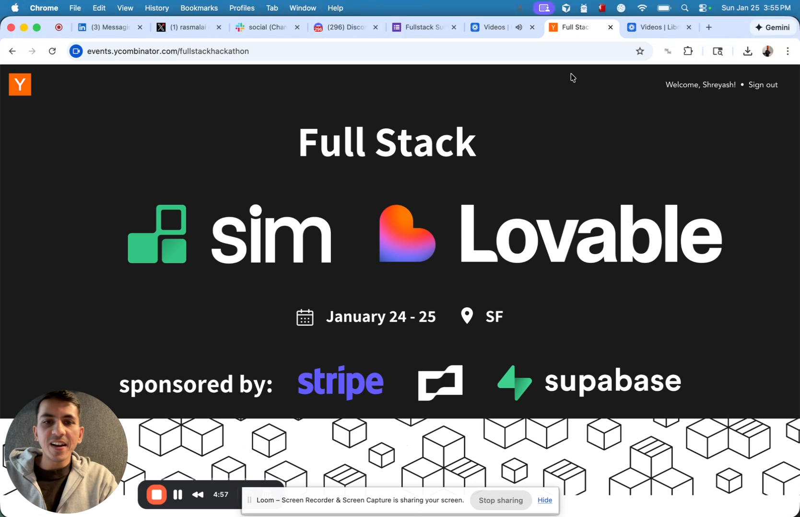

# TabTab

GitHub Copilot style autocomplete for web. Type something, get text suggestions, press **Tab** to accept.

## Demo

[](https://www.loom.com/share/25a3b04eee294267aa72234ba914aa35)

## Features

- **Ghost text suggestions** as you type
- **Chrome extension** for any website
- **Context-aware** on Discord, Slack, LinkedIn, Twitter/X
- **Custom tones** per app (Professional, Casual, etc.)

## Quick Start

```bash
npm install
cp .env.example .env.local  # Add your API key
npm run dev
```

Open [localhost:3000](http://localhost:3000)

## Chrome Extension

1. Run `npm run dev`
2. Go to `chrome://extensions/` → Enable Developer mode
3. Load unpacked → Select `extension/` folder
