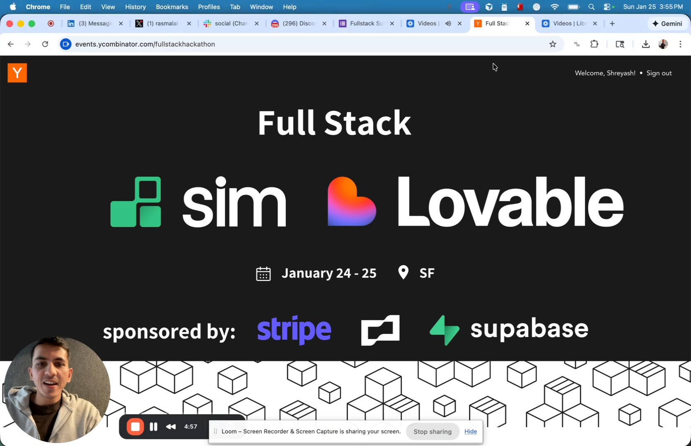

# TabTab

TabTab is an extension-first AI autocomplete project.

The Chrome extension injects inline ghost text suggestions into supported editors, and a local API route provides model completions.

## Demo

[](https://www.loom.com/share/25a3b04eee294267aa72234ba914aa35)

## Features

- Inline gray text suggestions as you type
- App-aware context extraction (Discord, LinkedIn, Slack, Twitter/X)
- Custom tone per app
- Suggestion length controls (Concise or Longer)
- Cloud sync for extension preferences

## Quick Start (Extension-First)

1. Install dependencies and configure env:
   ```bash
   npm install
   cp .env.example .env.local
   ```
   Add `GROQ_API_KEY` to `.env.local`.
2. Start the local API backend:
   ```bash
   npm run dev
   ```
3. Load the unpacked extension:
   - Open `chrome://extensions/`
   - Enable Developer mode
   - Click **Load unpacked**
   - Select the `extension/` folder

## Local Backend Contract

The extension service worker sends requests to:

- `POST http://localhost:3000/api/suggest`

Request body:

```json
{
  "text": "Draft message text",
  "context": ["recent context line 1", "recent context line 2"],
  "app": "linkedin",
  "customTone": "Professional and concise",
  "suggestionLength": "short"
}
```

Response body:

```json
{
  "suggestion": " ...continuation text"
}
```

Notes:

- Minimum input length is 5 characters.
- `suggestionLength` accepts `short` or `normal`.
- CORS is enabled for extension requests.
